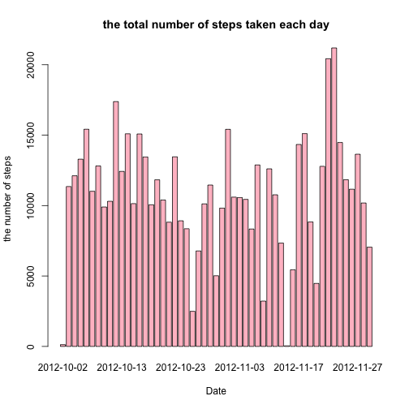
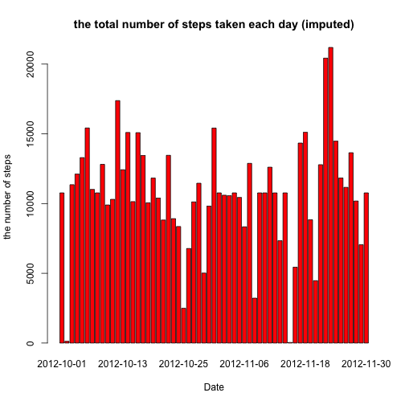

Reproducible Research: Peer Assessment 1
=========================================
by kojikami

Assignment Description:
* To write a report that answers the questions detailed below. 
* To complete the entire assignment in a single R markdown document that can be processed by knitr and be transformed into an HTML file.

## Loading and preprocessing the data
The zip file used is available for download at 
[Dataset: Activity monitoring data](https://d396qusza40orc.cloudfront.net/repdata%2Fdata%2Factivity.zip) [52K]

```r
monitor_data = read.csv(unz("activity.zip", "activity.csv"))
totalSteps <- aggregate(steps ~ date, data = monitor_data, FUN = sum)
```

## What is mean total number of steps taken per day?
* Make a histogram of the total number of steps taken each day

```r
barplot(totalSteps$steps, names.arg = totalSteps$date,
        xlab = "Date", ylab = "the number of steps", col = "pink",
        main = "the total number of steps taken each day")
```

 

* Calculate the __mean__ and __median__ total number of steps taken per day

```r
mean(totalSteps$steps)
```

```
## [1] 10766
```

```r
median(totalSteps$steps)
```

```
## [1] 10765
```

## What is the average daily activity pattern?
* Make a time series plot (i.e. `type = "l"`) of the 5-minute interval (x-axis) and the average number of steps taken, averaged across all days (y-axis)

```r
intervalSteps <- aggregate(steps ~ interval, data = monitor_data, FUN = mean)
plot(intervalSteps, type = "l")
```

 
* Which 5-minute interval, on average across all the days in the dataset, contains the maximum number of steps?

```r
intervalSteps$interval[which.max(intervalSteps$steps)]
```

```
## [1] 835
```
## Imputing missing values
* Calculate the total number of missing values in the dataset (i.e. the total number of rows with `NA`s)

```r
sum(is.na(monitor_data))
```

```
## [1] 2304
```
* Devise a strategy for filling in all of the missing values in the dataset. The strategy does not need to be sophisticated. For example, you could use the mean/median for that day, or the mean for that 5-minute interval, etc.

I will use the means for the 5-minute intervals as fillers for missing values.

* Create a new dataset that is equal to the original dataset but with the missing data filled in.

```r
new_monitor_data <- merge(monitor_data, intervalSteps, by = "interval", 
                          suffixes = c("", ".y"))
nas <- is.na(new_monitor_data$steps)
new_monitor_data$steps[nas] <- new_monitor_data$steps.y[nas]
new_monitor_data <- new_monitor_data[, c(1:3)]
```
* Make a histogram of the total number of steps taken each day and Calculate and report the mean and median total number of steps taken per day. Do these values differ from the estimates from the first part of the assignment? What is the impact of imputing missing data on the estimates of the total daily number of steps?

```r
new_totalSteps <- aggregate(steps ~ date, data = new_monitor_data, FUN = sum)
barplot(new_totalSteps$steps, names.arg = new_totalSteps$date, 
        xlab = "Date", ylab = "the number of steps", col = "red",
        main = "the total number of steps taken each day (imputed)")
```

 

```r
mean(new_totalSteps$steps)
```

```
## [1] 10766
```

```r
median(new_totalSteps$steps)
```

```
## [1] 10766
```
The impact of the missing data seems rather low, at least when estimating the total number of steps per day.

## Are there differences in activity patterns between weekdays and weekends?
* Create a new factor variable in the dataset with two levels – “weekday” and “weekend” indicating whether a given date is a weekday or weekend day.

```r
daytype <- function(date) {
    if (weekdays(as.Date(date)) %in% c("Saturday", "Sunday")) {
        "weekend"
    } else {
        "weekday"
    }
}
monitor_data$daytype <- as.factor(sapply(monitor_data$date, daytype))
```
* Make a panel plot containing a time series plot (i.e. `type = "l"`) of the 5-minute interval (x-axis) and the average number of steps taken, averaged across all weekday days or weekend days (y-axis). See the README file in the GitHub repository to see an example of what this plot should look like using simulated data.

```r
par(mfrow = c(2, 1))
for (type in c("weekend", "weekday")) {
    daytypeSteps <- aggregate(steps ~ interval, data = monitor_data, 
                      subset = monitor_data$daytype == type, FUN = mean)
    plot(daytypeSteps, type = "l", main = type)
}
```

 
